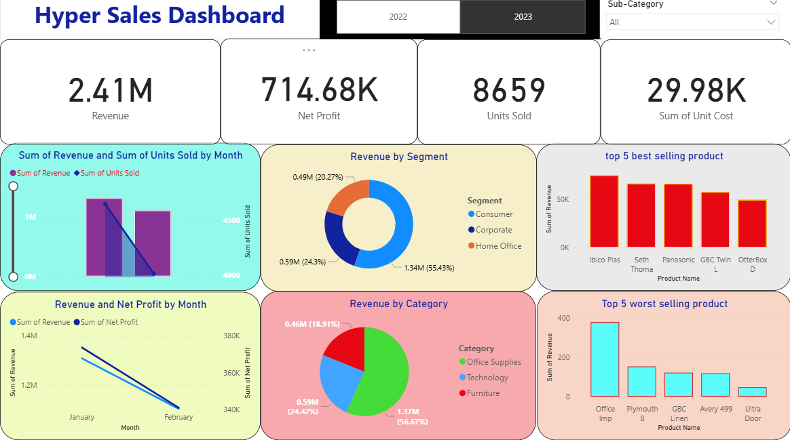
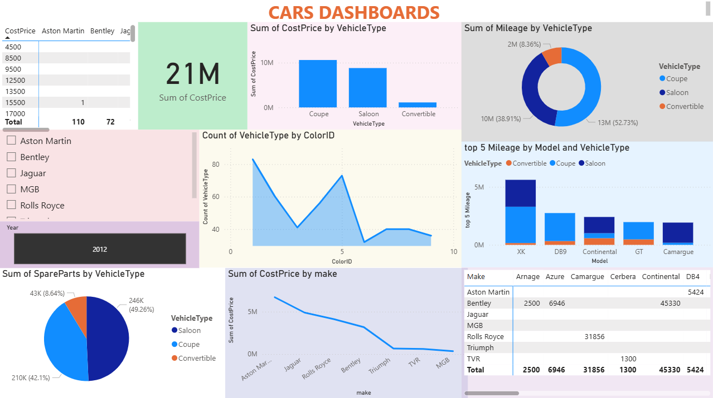
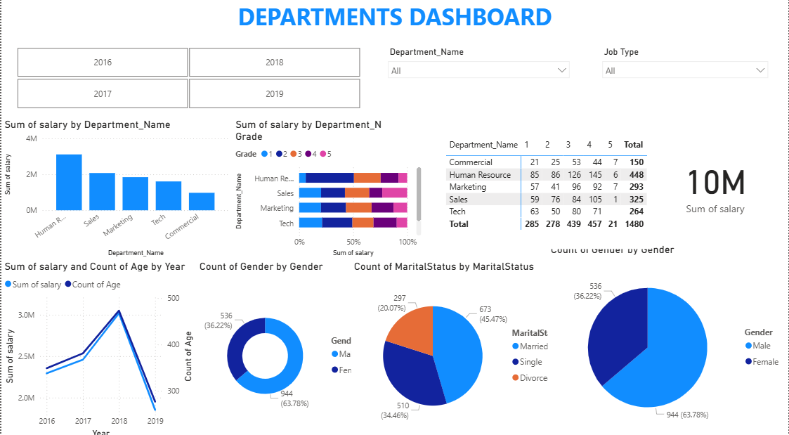

📊 Project Overview

The Power BI dashboards help transform raw data into meaningful visual stories.
They include various charts, cards, and filters to support data-driven decision-making.

Dashboards Included:

Hyper Sales Dashboard – Tracks revenue, profit, and regional sales performance

Cars Dashboard – Shows car model performance, sales by brand, and profit margins

Department Dashboard – Analyzes employee performance and department contribution

🧰 Tools & Technologies

Microsoft Power BI Desktop

Excel / CSV Data Sources

Power Query for data cleaning and transformation

DAX (Data Analysis Expressions) for creating calculated measures

⚙️ How to Use

Clone the repository

git clone https://github.com/shishirsalunkhe/PowerBI-Dashboard.git

Open .pbix file(s) in Power BI Desktop

Refresh dataset paths if required

Explore visuals, filters, and KPIs interactively

Optionally, publish to Power BI Service for online access

📁 Folder Structure
PowerBI-Dashboard/
│
├── Dashboards/           # Power BI (.pbix) files
├── Data/                 # Excel / CSV data sources
├── Images/               # Dashboard screenshots
│   ├── hypersales.png
│   ├── cars.png
│   └── departments.png
└── README.md

📸 Dashboard Outputs
🔹 Hyper Sales Dashboard

🔹 Cars Dashboard

🔹 Department Dashboard

📈 Key Insights

Visualizes Total Sales, Revenue Growth, and Performance Trends

Includes interactive slicers for region, category, and time period

Highlights KPIs like Profit %, Revenue per Product, and YoY Growth

Built with professional color schemes and clean layout

📜 License

This project is open-source under the MIT License.
Feel free to fork and use for your own analysis or learning purpose.
